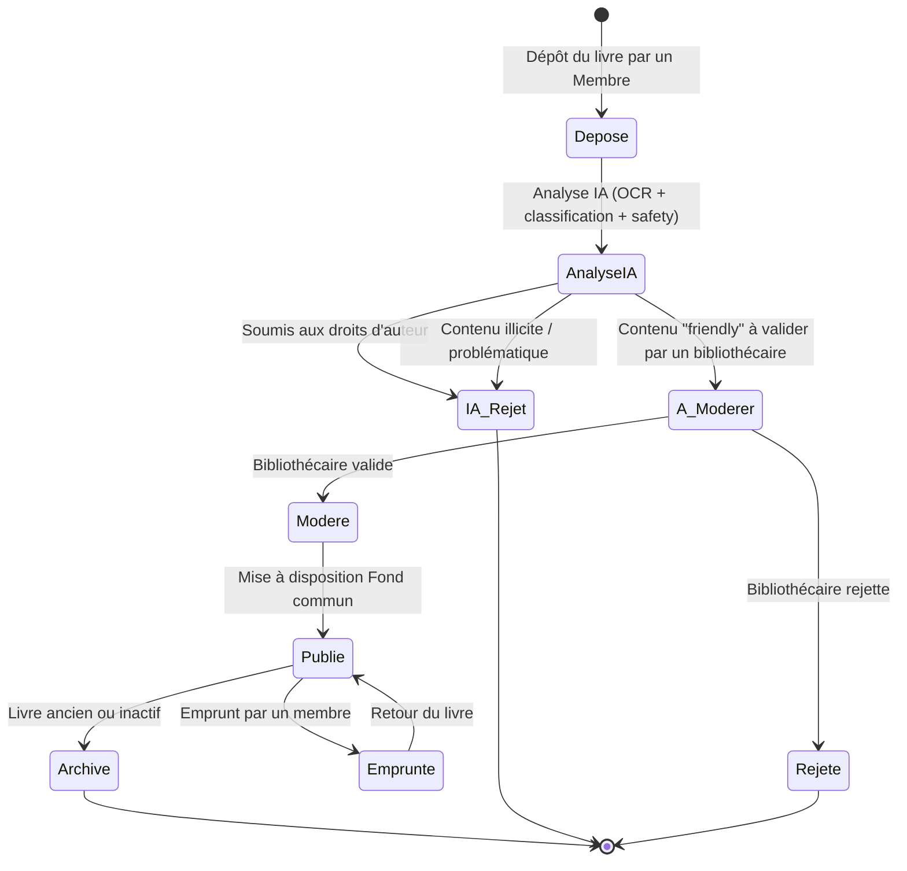

```mermaid
stateDiagram-v2
    [*] --> Depose : Dépôt du livre par un Membre

    Depose --> AnalyseIA : Analyse IA (OCR + classification + safety)

    %% === Décisions IA ===
    AnalyseIA --> IA_Rejet : Soumis aux droits d'auteur
    AnalyseIA --> IA_Rejet : Contenu illicite / problématique
    AnalyseIA --> A_Moderer : Contenu "friendly" à valider par un bibliothécaire

    %% === Modération humaine ===
    A_Moderer --> Modere : Bibliothécaire valide
    A_Moderer --> Rejete : Bibliothécaire rejette

    %% === Publication ===
    Modere --> Publie : Mise à disposition Fond commun

    %% === Cycle d’emprunt ===
    Publie --> Emprunte : Emprunt par un membre
    Emprunte --> Publie : Retour du livre

    %% === Archivage (optionnel) ===
    Publie --> Archive : Livre ancien ou inactif
    Archive --> [*]

    %% === États finaux ===
    IA_Rejet --> [*]
    Rejete --> [*]
```