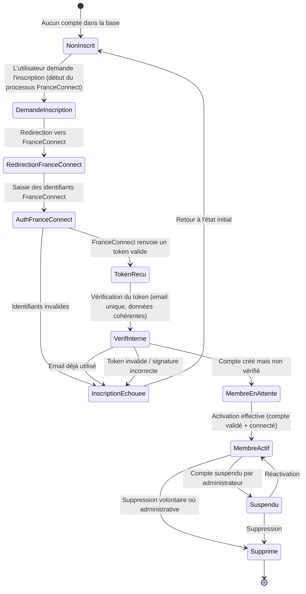

```mermaid
stateDiagram-v2

    %% --- ÉTAT INITIAL ---
    [*] --> NonInscrit : Aucun compte dans la base

    %% --- INSCRIPTION ---
    NonInscrit --> DemandeInscription : L'utilisateur demande l'inscription (début du processus FranceConnect)

    DemandeInscription --> RedirectionFranceConnect : Redirection vers FranceConnect
    RedirectionFranceConnect --> AuthFranceConnect : Saisie des identifiants FranceConnect

    %% --- RÉSULTAT FRANCECONNECT ---
    AuthFranceConnect --> InscriptionEchouee : Identifiants invalides
    InscriptionEchouee --> NonInscrit : Retour à l'état initial

    AuthFranceConnect --> TokenRecu : FranceConnect renvoie un token valide

    %% --- VALIDATION INTERNE ---
    TokenRecu --> VerifInterne : Vérification du token (email unique, données cohérentes)

    VerifInterne --> InscriptionEchouee : Email déjà utilisé
    VerifInterne --> InscriptionEchouee : Token invalide / signature incorrecte

    VerifInterne --> MembreEnAttente : Compte créé mais non vérifié

    %% --- ACTIVATION DU COMPTE ---
    MembreEnAttente --> MembreActif : Activation effective (compte validé + connecté)

    %% --- CYCLE DE VIE DU MEMBRE ---
    MembreActif --> Suspendu : Compte suspendu par administrateur
    Suspendu --> MembreActif : Réactivation

    MembreActif --> Supprime : Suppression volontaire où administrative
    Suspendu --> Supprime : Suppression
    Supprime --> [*]
```
