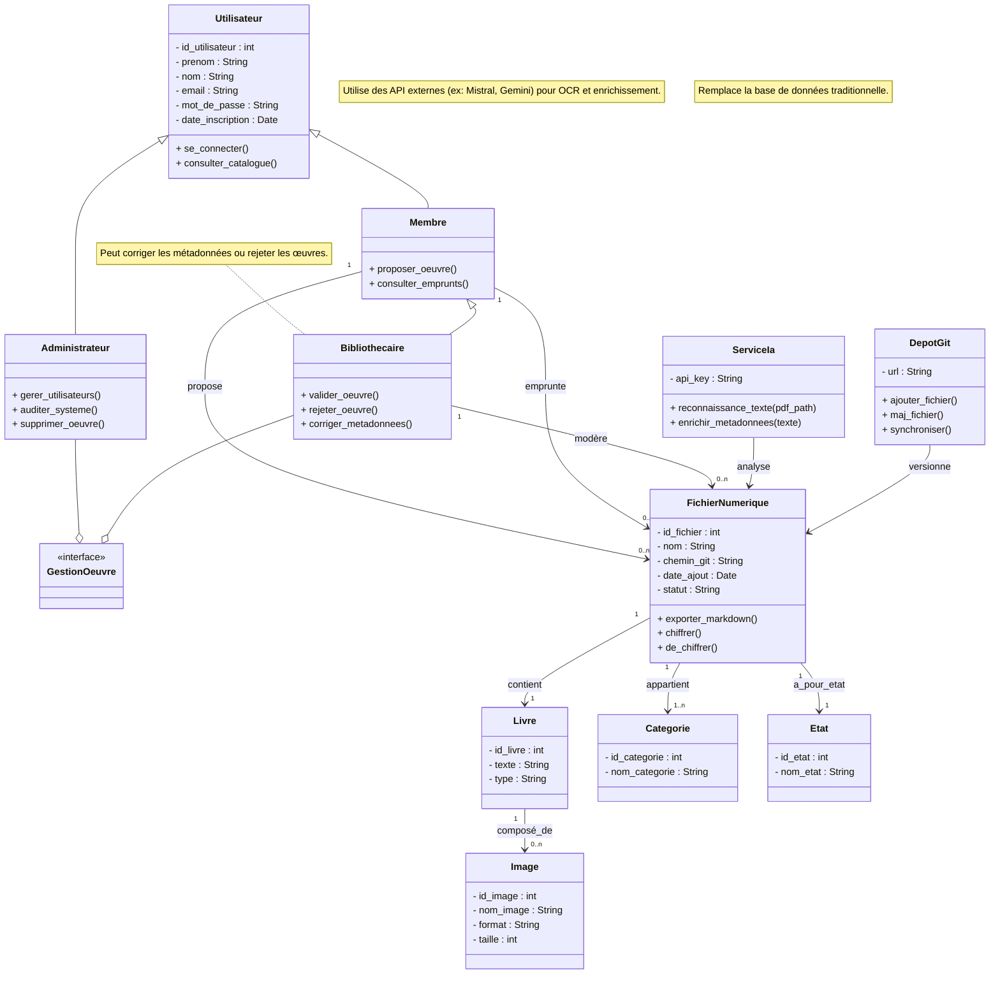

```mermaid
classDiagram
    %% =====================================
    %% === CLASSES MÉTIER PRINCIPALES ======
    %% =====================================

    class Utilisateur {
        - id_utilisateur : int
        - prenom : String
        - nom : String
        - email : String
        - mot_de_passe : String
        - date_inscription : Date
        + se_connecter()
        + consulter_catalogue()
    }

    class Membre {
        + proposer_oeuvre()
        + consulter_emprunts()
    }

    class Bibliothecaire {
        + valider_oeuvre()
        + rejeter_oeuvre()
        + corriger_metadonnees()
    }

    class Administrateur {
        + gerer_utilisateurs()
        + auditer_systeme()
        + supprimer_oeuvre()
    }

    class GestionOeuvre {
        <<interface>>
    }

    %% =====================================
    %% === CLASSES LIÉES AUX ŒUVRES ========
    %% =====================================

    class FichierNumerique {
        - id_fichier : int
        - nom : String
        - chemin_git : String
        - date_ajout : Date
        - statut : String
        + exporter_markdown()
        + chiffrer()
        + de_chiffrer()
    }

    class Livre {
        - id_livre : int
        - texte : String
        - type : String
    }

    class Categorie {
        - id_categorie : int
        - nom_categorie : String
    }

    class Etat {
        - id_etat : int
        - nom_etat : String
        %% Valeurs : "à modérer", "modéré", "publié", "séquestre"
    }

    class Image {
        - id_image : int
        - nom_image : String
        - format : String
        - taille : int
    }

    %% =====================================
    %% === CLASSES TECHNIQUES / IA =========
    %% =====================================

    class ServiceIa {
        - api_key : String
        + reconnaissance_texte(pdf_path)
        + enrichir_metadonnees(texte)
    }

    class DepotGit {
        - url : String
        + ajouter_fichier()
        + maj_fichier()
        + synchroniser()
    }

    %% =====================================
    %% === ASSOCIATIONS ====================
    %% =====================================

    %% Rôles
    Utilisateur <|-- Membre
    Membre <|-- Bibliothecaire
    Utilisateur <|-- Administrateur
    Administrateur --o GestionOeuvre
    Bibliothecaire --o GestionOeuvre

    %% Fichiers et contenu
    FichierNumerique "1" --> "1" Livre : contient
    FichierNumerique "1" --> "1..n" Categorie : appartient
    FichierNumerique "1" --> "1" Etat : a_pour_etat
    Livre "1" --> "0..n" Image : composé_de

    %% Relation membre / fichier
    Membre "1" --> "0..n" FichierNumerique : propose
    Membre "1" --> "0..n" FichierNumerique : emprunte

    %% Modération
    Bibliothecaire "1" --> "0..n" FichierNumerique : modère

    %% IA et dépôt
    ServiceIa --> FichierNumerique : analyse
    DepotGit --> FichierNumerique : versionne

    %% =====================================
    %% === NOTES ===========================
    %% =====================================
    note for Bibliothecaire "Peut corriger les métadonnées ou rejeter les œuvres."
    note for Ia_service "Utilise des API externes (ex: Mistral, Gemini) pour OCR et enrichissement."
    note for Depot_git "Remplace la base de données traditionnelle."
```

