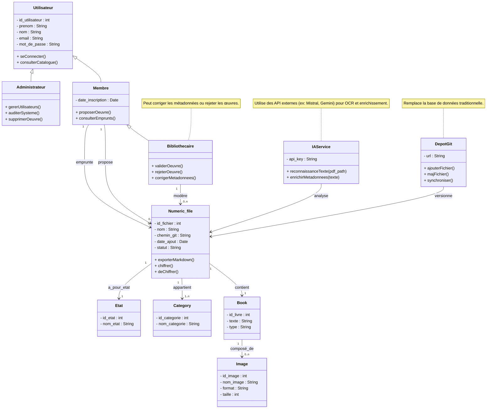

```mermaid
classDiagram
    %% =====================================
    %% === CLASSES MÉTIER PRINCIPALES ======
    %% =====================================

    class Utilisateur {
        - id_utilisateur : int
        - prenom : String
        - nom : String
        - email : String
        - mot_de_passe : String
        + seConnecter()
        + consulterCatalogue()
    }

    class Membre {
        - date_inscription : Date
        + proposerOeuvre()
        + consulterEmprunts()
    }

    class Bibliothecaire {
        + validerOeuvre()
        + rejeterOeuvre()
        + corrigerMetadonnees()
    }

    class Administrateur {
        + gererUtilisateurs()
        + auditerSysteme()
        + supprimerOeuvre()
    }

    %% =====================================
    %% === CLASSES LIÉES AUX ŒUVRES ========
    %% =====================================

    class Numeric_file {
        - id_fichier : int
        - nom : String
        - chemin_git : String
        - date_ajout : Date
        - statut : String
        + exporterMarkdown()
        + chiffrer()
        + deChiffrer()
    }

    class Book {
        - id_livre : int
        - texte : String
        - type : String
    }

    class Category {
        - id_categorie : int
        - nom_categorie : String
    }

    class Etat {
        - id_etat : int
        - nom_etat : String
        %% Valeurs : "à modérer", "modéré", "publié", "séquestre"
    }

    class Image {
        - id_image : int
        - nom_image : String
        - format : String
        - taille : int
    }

    %% =====================================
    %% === CLASSES TECHNIQUES / IA =========
    %% =====================================

    class IAService {
        - api_key : String
        + reconnaissanceTexte(pdf_path)
        + enrichirMetadonnees(texte)
    }

    class DepotGit {
        - url : String
        + ajouterFichier()
        + majFichier()
        + synchroniser()
    }

    %% =====================================
    %% === ASSOCIATIONS ====================
    %% =====================================

    %% Rôles
    Utilisateur <|-- Membre
    Membre <|-- Bibliothecaire
    Utilisateur <|-- Administrateur

    %% Fichiers et contenu
    Numeric_file "1" --> "1" Book : contient
    Numeric_file "1" --> "1..n" Category : appartient
    Numeric_file "1" --> "1" Etat : a_pour_etat
    Book "1" --> "0..n" Image : composé_de

    %% Relation membre / fichier
    Membre "1" --> "0..n" Numeric_file : propose
    Membre "1" --> "0..n" Numeric_file : emprunte

    %% Modération
    Bibliothecaire "1" --> "0..n" Numeric_file : modère

    %% IA et dépôt
    IAService --> Numeric_file : analyse
    DepotGit --> Numeric_file : versionne

    %% =====================================
    %% === NOTES ===========================
    %% =====================================
    note for Bibliothecaire "Peut corriger les métadonnées ou rejeter les œuvres."
    note for IAService "Utilise des API externes (ex: Mistral, Gemini) pour OCR et enrichissement."
    note for DepotGit "Remplace la base de données traditionnelle."
```