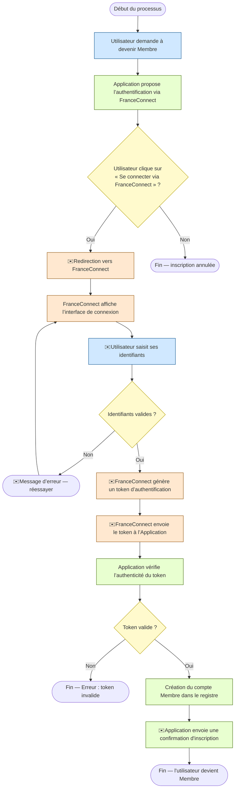

```mermaid
flowchart TD

    %% Définition des styles
    classDef user fill:#D0E8FF,stroke:#004B8D,stroke-width:1px
    classDef system fill:#E8FFD0,stroke:#3A6B00,stroke-width:1px
    classDef external fill:#FFE8D0,stroke:#8D4B00,stroke-width:1px
    classDef decision fill:#FFFACD,stroke:#b59d00,stroke-width:1px

    %% Début du processus
    A([Début du processus]) --> B[Utilisateur demande à devenir Membre]
    class B user

    B --> C[Application propose l’authentification via FranceConnect]
    class C system

    C --> D{Utilisateur clique sur<br/>« Se connecter via FranceConnect » ?}
    class D decision

    D -- Oui --> E[✉️Redirection vers FranceConnect]
    class E external

    D -- Non --> Z([Fin — inscription annulée])

    E --> F[FranceConnect affiche l’interface de connexion]
    class F external

    F --> G[✉️Utilisateur saisit ses identifiants]
    class G user

    G --> H{Identifiants valides ?}
    class H decision

    H -- Non --> I([✉️Message d’erreur — réessayer])
    I --> F

    H -- Oui --> J[✉️FranceConnect génère un token d’authentification]
    class J external

    J --> K[✉️FranceConnect envoie le token à l’Application]
    class K external

    K --> L[Application vérifie l’authenticité du token]
    class L system

    L --> M{Token valide ?}
    class M decision

    M -- Non --> X([Fin — Erreur : token invalide])

    M -- Oui --> N[Création du compte Membre dans le registre]
    class N system

    N --> O[✉️Application envoie une confirmation d'inscription]
    class O system

    O --> P([Fin — l'utilisateur devient Membre])
```
