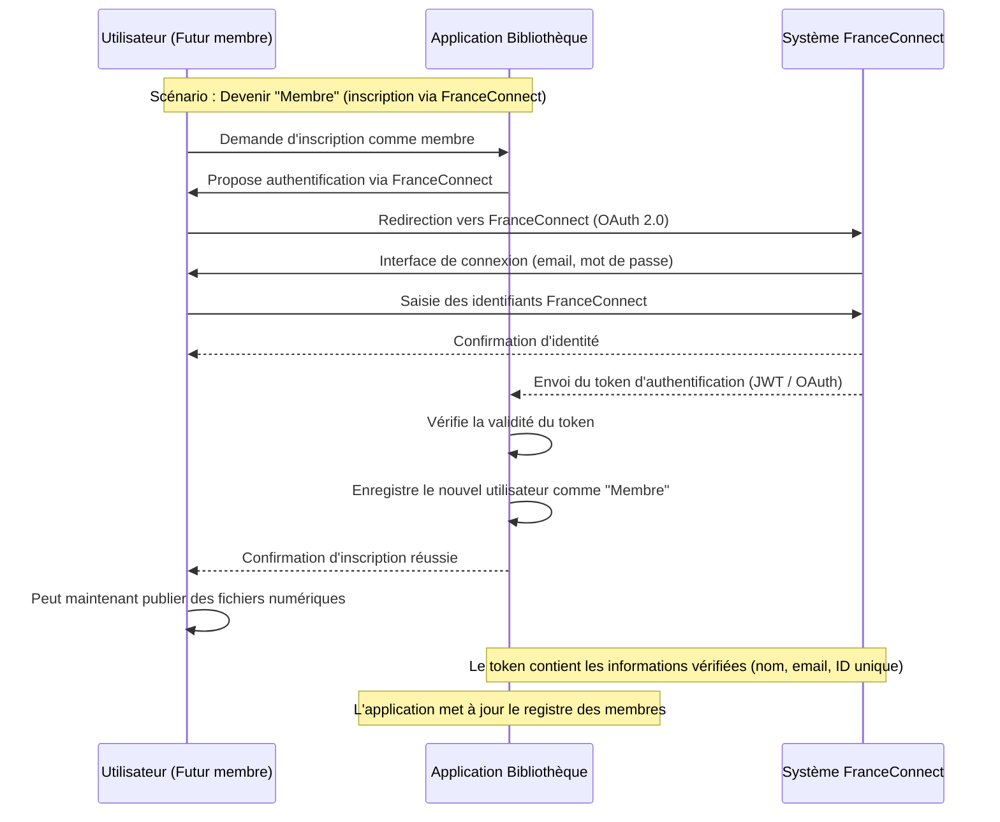

```mermaid
sequenceDiagram
    participant U as Utilisateur (Futur membre)
    participant B as Application Bibliothèque
    participant F as Système FranceConnect

    Note over U,B: Scénario : Devenir "Membre" (inscription via FranceConnect)

    U->>B: Demande d'inscription comme membre
    B->>U: Propose authentification via FranceConnect
    U->>F: Redirection vers FranceConnect (OAuth 2.0)
    F->>U: Interface de connexion (email, mot de passe)
    U->>F: Saisie des identifiants FranceConnect
    F-->>U: Confirmation d'identité
    F-->>B: Envoi du token d'authentification (JWT / OAuth)
    B->>B: Vérifie la validité du token
    B->>B: Enregistre le nouvel utilisateur comme "Membre"
    B-->>U: Confirmation d'inscription réussie
    U->>U: Peut maintenant publier des fichiers numériques

    Note over F,B: Le token contient les informations vérifiées (nom, email, ID unique)
    Note over B: L'application met à jour le registre des membres
```
